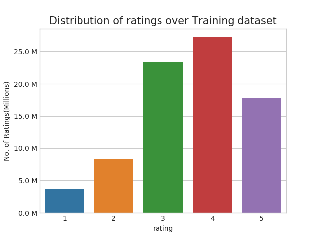
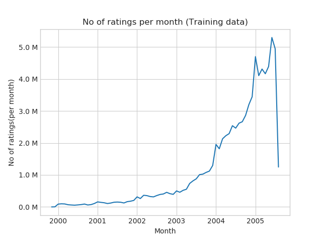
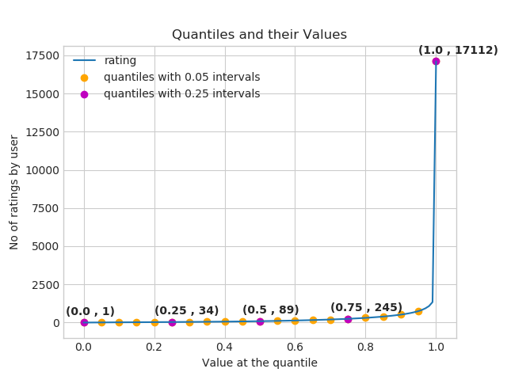
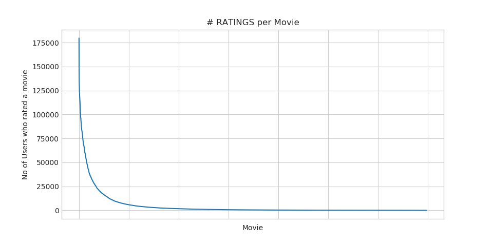
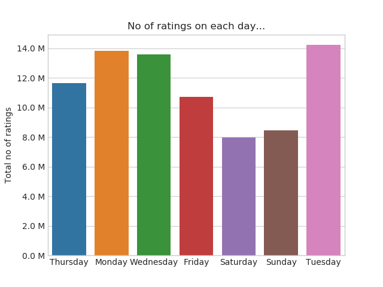
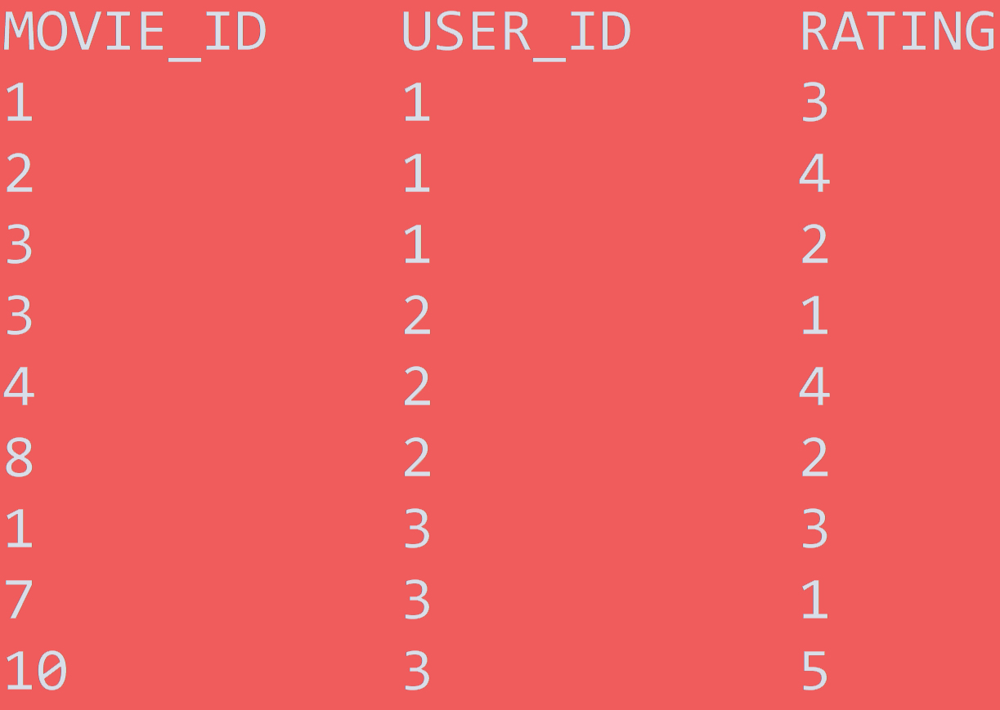

# Netflix Movie Recommendation System

## Buisness Problem

### Problem Description

Netflix is all about connecting people to the movies they love. To help customers find those movies, they developed world-class movie recommendation system: CinematchSM. Its job is to predict whether someone will enjoy a movie based on how much they liked or disliked other movies. Netflix use those predictions to make personal movie recommendations based on each customer’s unique tastes. And while <b>Cinematch</b> is doing pretty well, it can always be made better.

Now there are a lot of interesting alternative approaches to how Cinematch works that netflix haven’t tried. Some are described in the literature, some aren’t. We’re curious whether any of these can beat Cinematch by making better predictions. Because, frankly, if there is a much better approach it could make a big difference to our customers and our business.

 Credits: https://www.netflixprize.com/rules.html 

### Problem Statement

Netflix provided a lot of anonymous rating data, and a prediction accuracy bar that is 10% better than what Cinematch can do on the same training data set. (Accuracy is a measurement of how closely predicted ratings of movies match subsequent actual ratings.) 

### Real World/Buisness objectives and constraints.

Objectives:
1. Predict the rating that a user would give to a movie that he ahs not yet rated.
2. Minimize the difference between predicted and actual rating (RMSE and MAPE)
 

Constraints:
1. Some form of interpretability.

## 2. Machine Learning Problem

### 2.1 Data Overview

 Get the data from : https://www.kaggle.com/netflix-inc/netflix-prize-data/data 

 Data files : 
<ul> 
<li> combined_data_1.txt </li>
<li> combined_data_2.txt </li>
<li> combined_data_3.txt </li>
<li> combined_data_4.txt </li>
<li> movie_titles.csv </li>
</ul>
<pre>  
The first line of each file [combined_data_1.txt, combined_data_2.txt, combined_data_3.txt, combined_data_4.txt] contains the movie id followed by a colon. Each subsequent line in the file corresponds to a rating from a customer and its date in the following format:

CustomerID,Rating,Date

MovieIDs range from 1 to 17770 sequentially.
CustomerIDs range from 1 to 2649429, with gaps. There are 480189 users.
Ratings are on a five star (integral) scale from 1 to 5.
Dates have the format YYYY-MM-DD.
</pre>

**Example Data point**

<pre>
1:
1488844,3,2005-09-06
822109,5,2005-05-13
885013,4,2005-10-19
30878,4,2005-12-26
823519,3,2004-05-03
893988,3,2005-11-17
.
.
.
</pre>

### 2.2 Mapping this problem into machine learning problem

- Given a movie and user, we need to predict the rating given by him/her to the movies.
- This problem can be pose as a recommendation problem.
- Also, it can be seen as a regression problem.

### 2.3 Performance Metric

<ul>
<li> Mean Absolute Percentage Error: https://en.wikipedia.org/wiki/Mean_absolute_percentage_error </li>
<li> Root Mean Square Error: https://en.wikipedia.org/wiki/Root-mean-square_deviation </li>
</ul>

### 2.4 Machine Learning Objective and constraints.
<ul>
  <li> Minimize RMSE. </li>
  <li> Try to provide some interpretability.</li>
</ul>

**Note: here, we do not have low-latency constraint as these type of systems at an indsutry level do not compute what you might like right when you are logged in to your id. It actually pre-compute results like for a user(u_i) it might like [m_1,m_2,m_8,m_10] and store it in a hash table/lookup table and show results as soon as you logged in.**

## 3. Preprocessing steps

### 3.1 Converting/merging this raw files (combined_data_1.txt','combined_data_2.txt', 'combined_data_3.txt', 'combined_data_4.txt) to a required format: user_i, movie_i, rating_ij, data_i.
### 3.2 Checking for Nan values.
### 3.3 Removing Duplicate values.
### 3.4 Splittig into train/test(80:20)
### 3.5 Basic statistics in train data
<pre>
<ul>
<li> Total no of ratings : 80384405 </li>
<li> Total No of Users   : 405041 </li>
<li> Total No of movies  : 17424 </li>
</ul>
</pre>

### 3.6 Basic statistics in train data
<pre>
<ul>
<li> Total no of ratings : 20096102 </li>
<li> Total No of Users   : 349312 </li>
<li> Total No of movies  : 17757 </li>
</ul>
</pre>

## 4. Exploratory Data Analysis on train data.

### 4.1 Distribution of ratings

### 4.2 Number of ratings per month

### 4.3 Analysis of ratings given by user.

Observaton(s): 
- Median of user rating is 89.
- 75% of the user have rated less than equal to 245 movies.
- One person has rated 17112 movies.

### 4.4 Analysis of ratings of a movie given by a user

Observation(s):

- There are some movies (which are very popular) which are rated by huge number of users.
- But most of the movies(like 90%) got some hundereds of ratings.

### 4.5 Number of rating on a given day of week.

Observation(s):

- It is surprise to observe that more number of ratings are not given on weekends but in week days.

### 4.6 Cold Start Problem: is a proablem of making recommendations when the user/movie is new i.e not present in the training set.

#### 4.6.1 Cold start problem with users
<pre>
- Total number of Users  : 480189
- Number of Users in Train data : 405041
- No of Users that didn't appear in train data: 75148(15.65 %) 

> We might have to handle __new users__ ( ___75148___ ) who didn't appear in train data.
</pre>

#### 4.6.2 Cold start problem with movies
<pre>
- Total number of Movies  : 17770
- Number of Users in Train data : 17424
- No of Movies that didn't appear in train data: 346(1.95 %) 

> We might have to handle __346 movies__ (small comparatively) in test data
</pre>

## 5. Feature Engineering.

### 5.1 Creating sparse matrix from dataframe.

<table>
<tr>
<td>

</td>
<td>

</td>
<td>

</td>
</tr>
</table>

### 5.2 Sampling Data: Instead of working over complete train/test data. We are going to take a sample of train(10,000 users and 1000 movies) and test data(5000 users and 500 movies) to work on.
<pre>
- No of ratings in Our Sampled train matrix is : 129286
- No of ratings in Our Sampled test  matrix is : 7333
</pre>

### 5.3 Finding Global average of all the movie ratings (from sampled train).
<pre>
Global average rating: 3.5
</pre>
### 5.3 Finding average rating per user.
<pre>
Average rating of user 1515220  : 3.9
</pre>
### 5.4 Finding average rating per movie.
<pre>
Average rating of movie 15153  : 2.6
</pre>

### 5.5 Top 5 ratings of "movie" by similar users of "user".

### Top 5 ratings by a "user" to similar movies of "movie".

###  13 hand crafted features that can be used as x_i to predict y_i (rating).

	user	movie	GAvg	sur1	sur2	sur3	sur4	sur5	smr1	smr2	smr3	smr4	smr5	UAvg	MAvg	rating
0	808635	71	3.581679	3.581679	3.581679	3.581679	3.581679	3.581679	3.581679	3.581679	3.581679	3.581679	3.581679	3.581679	3.581679	5
1	941866	71	3.581679	3.581679	3.581679	3.581679	3.581679	3.581679	3.581679	3.581679	3.581679	3.581679	3.581679	3.581679	3.581679	4
2	1737912	71	3.581679	3.581679	3.581679	3.581679	3.581679	3.581679	3.581679	3.581679	3.581679	3.581679	3.581679	3.581679	3.581679	3
3	1849204	71	3.581679	3.581679	3.581679	3.581679	3.581679	3.581679	3.581679	3.581679	3.581679	3.581679	3.581679	3.581679	3.581679	4

